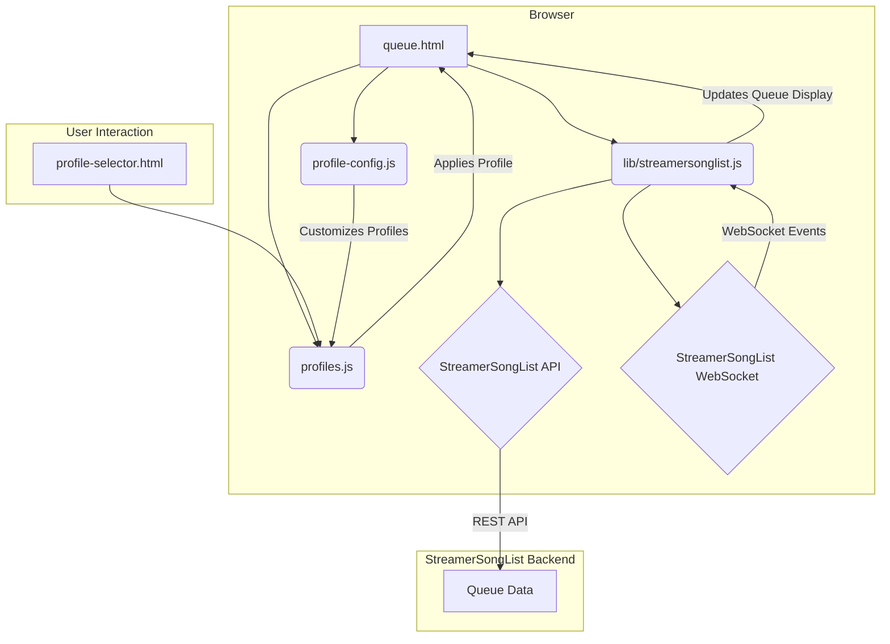

# Code Summary

This document provides a summary of the StreamerSongList Overlay codebase, including a Mermaid diagram illustrating the data flow.

## Overview

The project is a web-based overlay for Twitch streamers using `streamersonglist.com`. It displays the current song queue with various visual styles and animations. The overlay is highly customizable through a profile system.

## File Structure

- **`queue.html`**: The main entry point for the overlay. It includes the necessary CSS and JavaScript files.
- **`lib/streamersonglist.js`**: The core logic of the application. It handles communication with the StreamerSongList API and WebSocket server, manages the song queue, and updates the display.
- **`profiles.js`**: Defines the different visual profiles for the overlay. Each profile is a collection of settings for colors, fonts, effects, and layout.
- **`profile-config.js`**: Allows users to create custom profiles or override existing ones without modifying the core `profiles.js` file.
- **`queue.css`**: The main stylesheet for the overlay.
- **`profiles.css`**: Contains the CSS rules for the different profiles.

## Core Functionality

### 1. Data Fetching and Real-time Updates

- **`lib/streamersonglist.js`** is responsible for fetching data from the StreamerSongList API.
- It uses `jQuery.ajax` to make REST API calls to fetch the initial queue and streamer information.
- For real-time updates, it connects to the StreamerSongList WebSocket server using `socket.io`.
- The WebSocket connection listens for events like `queue-update`, `new-song`, and `delete-song` to keep the queue display in sync.

### 2. Queue Management

- The `updateQueueSuccess` function in `lib/streamersonglist.js` processes the queue data received from the API.
- It sorts the queue, applies the `maxQueueItems` limit, and generates the HTML for each song in the queue.
- The `createSongDiv` function creates the HTML for a single song, including the title, artist, and requester.
- The `startQueueRotation` function handles the rotation of songs in the queue if there are more songs than can be displayed at once.

### 3. Profile System

- The profile system allows for extensive customization of the overlay's appearance.
- **`profiles.js`** contains a `profiles` object with predefined profiles like "Superhero", "Minimal", and "Neon".
- Each profile defines fonts, colors, effects (animations, glow, etc.), layout, and background styles.
- **`profile-config.js`** allows users to add their own profiles or override the default ones.
- The `applyProfile` function in `profiles.js` applies a selected profile by setting CSS variables and classes on the HTML elements.

## Mermaid Diagram

The following diagram illustrates the data flow and component interaction in the application:

### Diagram Explanation

1.  **`queue.html`** is the main page that loads the necessary JavaScript files.
2.  **`lib/streamersonglist.js`** is the core script that communicates with the backend.
3.  It fetches initial queue data from the **StreamerSongList REST API**.
4.  It establishes a **WebSocket connection** for real-time updates.
5.  **`profiles.js`** defines the visual profiles.
6.  **`profile-config.js`** allows for user customization of profiles.
7.  Users can select a profile using **`profile-selector.html`**, which then calls functions in `profiles.js` to apply the selected theme.
8.  `lib/streamersonglist.js` updates the queue display in `queue.html` based on the data it receives.
